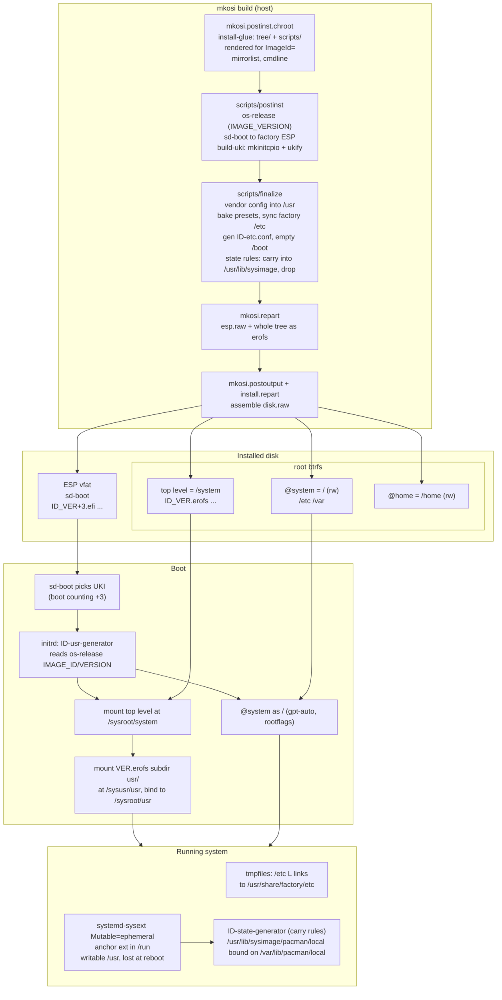
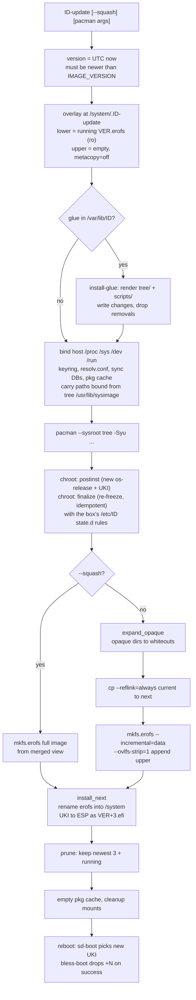

# Design

ID is `ImageId=` (`mkosi.conf`): every name below derives from it.

## Build, disk and boot

```mermaid
flowchart TD
	subgraph BUILD["mkosi build (host)"]
		P["mkosi.postinst.chroot<br/>install-glue: tree/ + scripts/<br/>rendered for ImageId=<br/>mirrorlist, cmdline"]
		PI["scripts/postinst<br/>os-release (IMAGE_VERSION)<br/>sd-boot to factory ESP<br/>build-uki: mkinitcpio + ukify"]
		F["scripts/finalize<br/>vendor config into /usr<br/>bake presets, sync factory /etc<br/>gen ID-etc.conf, empty /boot<br/>state rules: carry into /usr/lib/sysimage, drop"]
		R["mkosi.repart<br/>esp.raw + whole tree as erofs"]
		PO["mkosi.postoutput + install.repart<br/>assemble disk.raw"]
		P --> PI --> F --> R --> PO
	end

	subgraph DISK["Installed disk"]
		ESP["ESP vfat<br/>sd-boot<br/>ID_VER+3.efi ..."]
		subgraph BTRFS["root btrfs"]
			TOP["top level = /system<br/>ID_VER.erofs ..."]
			SYS["@system = / (rw)<br/>/etc /var"]
			HOME["@home = /home (rw)"]
		end
	end

	PO --> ESP
	PO --> TOP
	PO --> SYS
	PO --> HOME

	subgraph BOOT["Boot"]
		SB["sd-boot picks UKI<br/>(boot counting +3)"]
		GEN["initrd: ID-usr-generator<br/>reads os-release IMAGE_ID/VERSION"]
		M1["mount top level at /sysroot/system"]
		M2["mount VER.erofs subdir usr/<br/>at /sysusr/usr, bind to /sysroot/usr"]
		ROOT["@system as / (gpt-auto, rootflags)"]
		SB --> GEN --> M1 --> M2
		GEN --> ROOT
	end

	ESP --> SB
	TOP --> M1
	SYS --> ROOT

	subgraph RUN["Running system"]
		ETC["tmpfiles: /etc L links<br/>to /usr/share/factory/etc"]
		PAC["ID-state-generator (carry rules)<br/>/usr/lib/sysimage/pacman/local bound on /var/lib/pacman/local"]
		SX["systemd-sysext Mutable=ephemeral<br/>anchor ext in /run<br/>writable /usr, lost at reboot"]
		SX --> PAC
	end

	M2 --> RUN
	ROOT --> RUN
```

## Update (ID-update)

```mermaid
flowchart TD
	START["ID-update [--squash] [pacman args]"] --> V["version = UTC now<br/>must be newer than IMAGE_VERSION"]
	V --> OV["overlay at /system/.ID-update<br/>lower = running VER.erofs (ro)<br/>upper = empty, metacopy=off"]
	OV --> G{"glue in /var/lib/ID?"}
	G -- yes --> GC["install-glue: render tree/ + scripts/<br/>write changes, drop removals"]
	G -- no --> MB
	GC --> MB["bind host /proc /sys /dev /run<br/>keyring, resolv.conf, sync DBs, pkg cache<br/>carry paths bound from tree /usr/lib/sysimage"]
	MB --> PM["pacman --sysroot tree -Syu ..."]
	PM --> CH["chroot: postinst (new os-release + UKI)<br/>chroot: finalize (re-freeze, idempotent)<br/>with the box's /etc/ID state.d rules"]
	CH --> SQ{"--squash?"}
	SQ -- yes --> FULL["mkfs.erofs full image<br/>from merged view"]
	SQ -- no --> EO["expand_opaque<br/>opaque dirs to whiteouts"]
	EO --> RL["cp --reflink=always current to next"]
	RL --> INC["mkfs.erofs --incremental=data<br/>--ovlfs-strip=1 append upper"]
	FULL --> INST
	INC --> INST["install_next<br/>rename erofs into /system<br/>UKI to ESP as VER+3.efi"]
	INST --> PR["prune: keep newest 3 + running"]
	PR --> CL["empty pkg cache, cleanup mounts"]
	CL --> RB["reboot: sd-boot picks new UKI<br/>bless-boot drops +N on success"]
```
